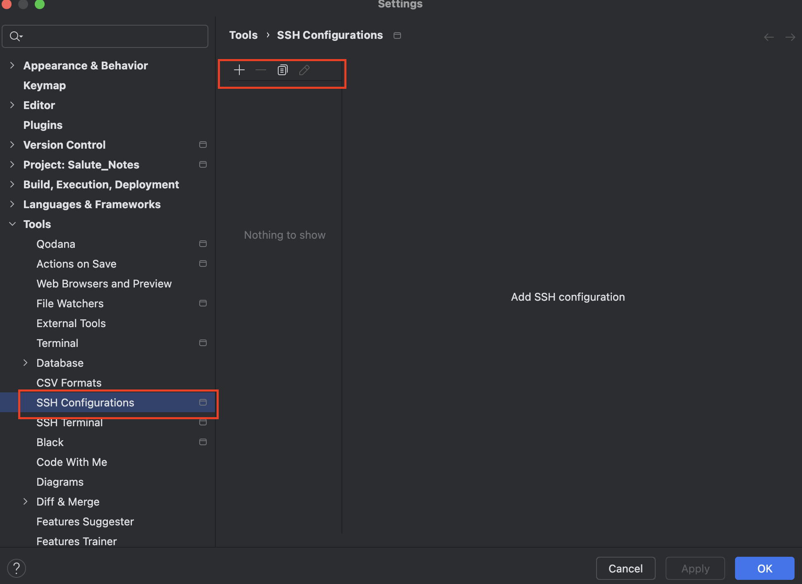

# PyCharm 删除终端连接记录教程

## 步骤1: 打开设置

点击PyCharm顶部菜单栏的 `File`，然后选择 `Settings`。

## 步骤2: 访问SSH配置
在设置窗口中，找到并点击 `Tools`，然后选择 `SSH Configurations`。

## 步骤3: 删除连接记录
在SSH Configurations页面，您会看到所有已保存的SSH连接记录。选中您想要删除的连接历史，然后点击页面下方的 `-` 符号即可实现删除操作。

## 附加说明
- 确保您在操作前已经保存了所有重要的连接信息，因为删除操作不可逆。
