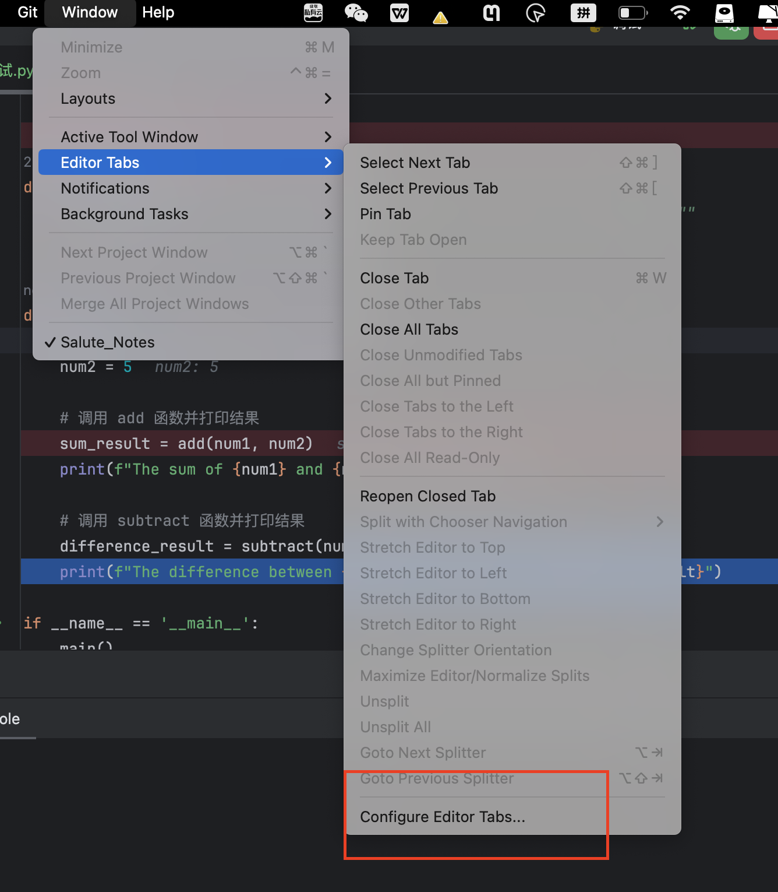
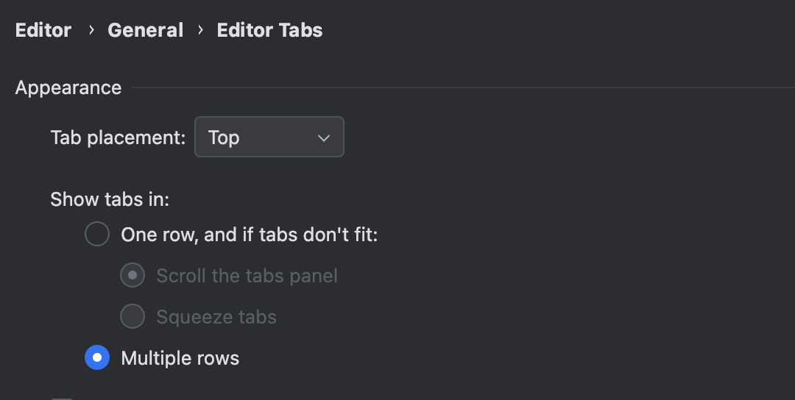

## 多行展示文件tab页

通常，当在 PyCharm 中打开多个文件时，如果标签页过多，它们会在界面的右侧隐藏起来，这可能会导致用户在查找和切换标签页时感到不便。

### 操作步骤

**Step1：**打开 PyCharm。

**Step2：**选择菜单栏中的 `Windows` -> `Editor Tabs` -> `Configure Editor Tabs`（偏好设置）（在 macOS 上）。

**Step3：**在设置窗口中，找到`Show tabs in:`，选择`Multiple rows`，`Apply`即可