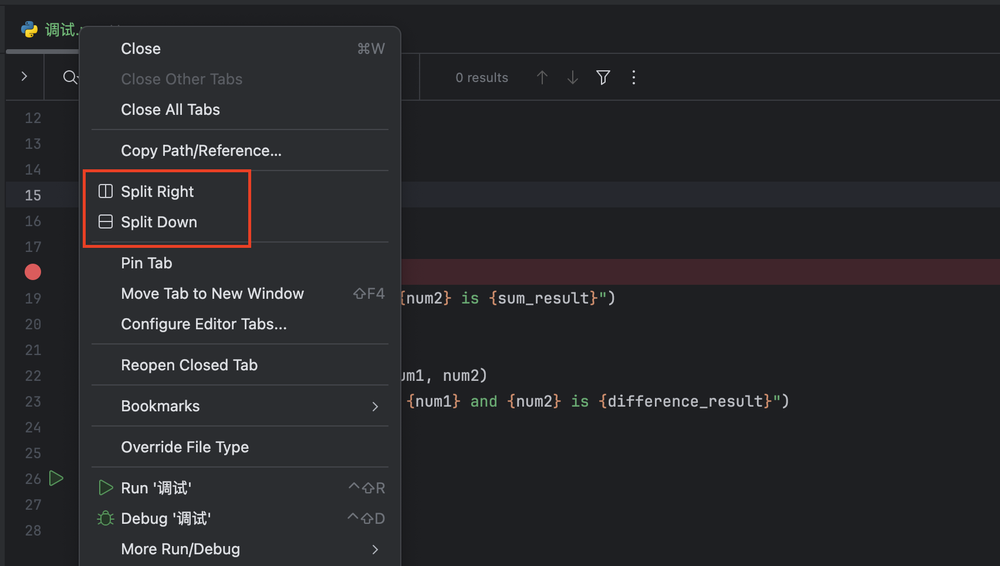

## 快捷键

在 PyCharm 中，Mac 用户使用的快捷键与 Windows/Linux 用户略有不同。以下是一些常用的 PyCharm 快捷键，专门针对 Mac 系统：

### 1、打开类或文件

- `⌘ + O`：打开文件选择对话框。

### 2、查找替换

- `⌘ + F`：在当前文件中查找。
- `⌘ + R`：替换文本。

### 3、跳转到定义

- `⌘ + B`：跳转到变量或方法的定义。

### 4、查找用法/查找引用

- `⌥ + F7`：查找变量或方法的用法。
- `⌘ + F7`：显示变量或方法的引用。

### 5、运行和调试

- `⌘ + F5`：运行当前项目。
- `⌘ + F6` 或 `⇧ + F5`：在调试模式下运行当前项目。

### 6、书签

- `F11`：添加或删除普通书签。
- `⇧ + F11`：显示所有书签。

### 7、导航

- `⌘ + [`：跳转到前一个编辑位置。
- `⌘ + ]`：跳转到下一个编辑位置。

### 8、代码折叠

- `⌘ + ⌥ + -`：折叠当前代码块。
- `⌘ + ⌥ + +`：展开当前代码块。

### 9、切换布局

- `⌘ + ⌥ + L` 或 `⌘ + ⇧ + F12`：切换不同的代码视图布局。

### 10、查看结构

- `⌘ + 7`：打开当前文件的结构视图。

## 分屏查看代码

在代码tab页处右键，选择`Split Right` 在右侧分屏，选择`SplitDown` 在下侧分屏。

