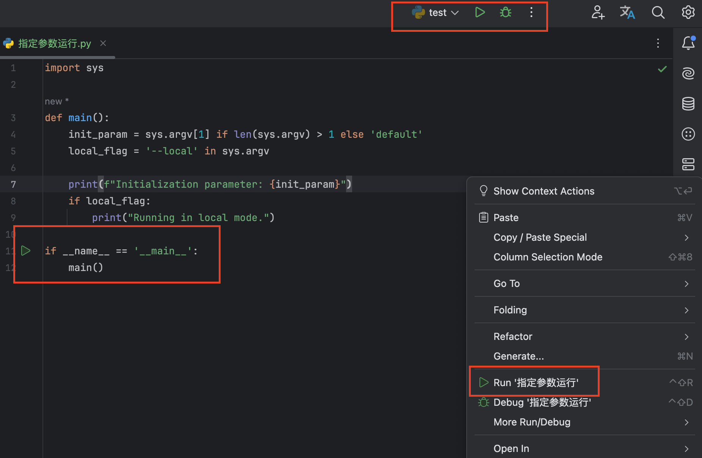
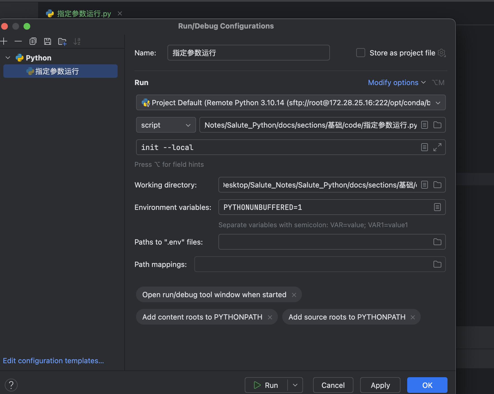
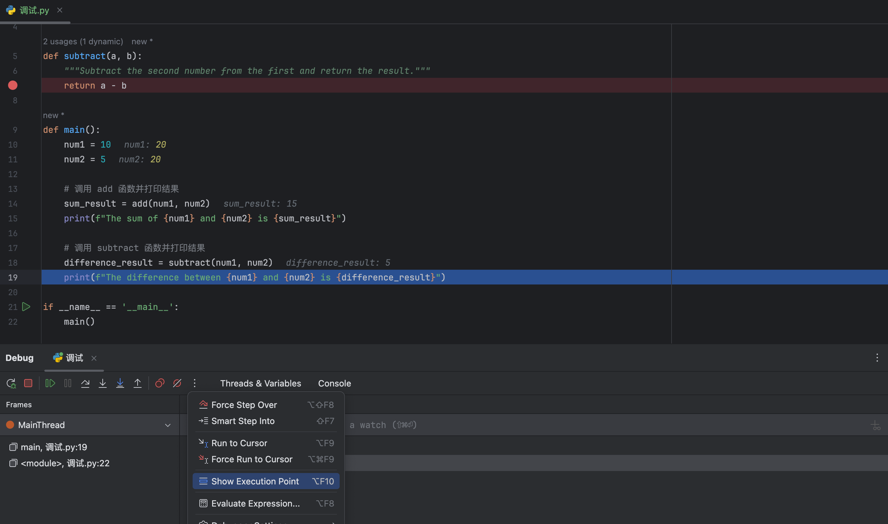

## 一、设置 Python 解释器

电脑上可以存在多个版本的Python解释器，所以在执行Python程序前，需要在 PyCharm 中设置要使用的 Python 解释器版本。设置步骤如下：

**Step1：打开设置：**启动 PyCharm 后，进入设置界面，点击菜单栏中的 `PyCharm` -> `Settings` 来打开设置。

**Step2：搜索 Interpreter：**在设置界面的搜索框中输入 "Interpreter"，快速定位到解释器设置部分。

**Step3：添加解释器：**在 `Project：***` ->  `Python Interpreter` 页面，可以看到当前项目使用的解释器。点击`Add Interpreter` 按钮来添加新的解释器。

配置完成后，点击 "OK" 或 "Apply" 保存设置。

## 二、运行 Python 程序方法

### 1、RUN运行

右键点击并选择 Run。

利用 PyCharm 记录的运行记录直接运行。

使用程序内的 `if __name__ == '__main__': main()` 结构出现的运行按钮。

### 2、指定参数

在 PyCharm 中通过指定参数执行程序，可以按照以下步骤操作：

**Step1：打开运行配置**：首先，需要配置或选择一个运行配置。如果你已经有一个 Python 脚本并运行过至少一次，它将出现在运行配置列表中。如果没有，可以通过点击 PyCharm 顶部菜单栏的 "Run" -> "Edit Configurations..." 来添加一个新的运行配置。

**Step2：设置脚本参数**：在 "Run/Debug Configurations" 窗口中，找到你的 Python 脚本配置，选中它。在右侧的配置详情中，找到 "Script parameters" 字段。

**Step3：输入参数**：在 "Script parameters" 字段中输入你想要传递给 Python 脚本的参数。例如，如果你的脚本名称为 `main.py`，并且你想传递参数 `init` 和 `--local`，那么你应该在 "Script parameters" 字段中输入 `init --local`。

**Step4：保存配置**：配置好参数后，点击 "OK" 或 "Apply" 保存你的设置。

**Step5：运行程序**：现在，你可以通过点击 PyCharm 右上角的运行按钮（一个绿色的三角形图标）来执行你的程序，程序将会使用你指定的参数运行。

## 三、调试代码

### 1、调试过程

**Step1：**在需要调试的地方设置断点。

**Step2：**使用调试模式运行 Python 程序。

**Step3：**使用各种调试手段。

### 2、调试控制窗口（Debug Tool Window）

- **Show Execution Point** (`⌘ + F8` on macOS, `Ctrl + F8` on Windows/Linux)：无论代码编辑窗口的光标在何处，点击此按钮都会跳转到程序运行的地方。
- **Step Over** (`F8`)：单步执行代码，如果遇到子函数则不会进入子函数内部。
- **Step Into** (`F7`)：单步执行代码，并且会进入任何被调用的函数内部。
- **Step Into My Code**：单步执行代码，但只进入用户自己的代码，不进入库函数等。
- **Step Out** (`⇧ + F8` on macOS, `Shift + F8` on Windows/Linux)：从当前函数内跳出，回到此函数被调用的地方。
- **Run To Cursor** (`Alt + F9` on macOS, `Alt + F9` on Windows/Linux)：运行到光标所在的行。
- **Evaluate Expression**：允许在调试时评估和修改变量的值。

### 3、变量查看窗口（Variables Window）

显示当前断点处所有变量的值，可以观察和修改变量。

### 4、线程控制窗口（Threads Window）

显示当前程序中的线程列表，可以选择不同的线程进行调试。

### 5、程序控制窗口（Frames Window）

显示当前调用栈，可以查看函数的调用顺序和位置。